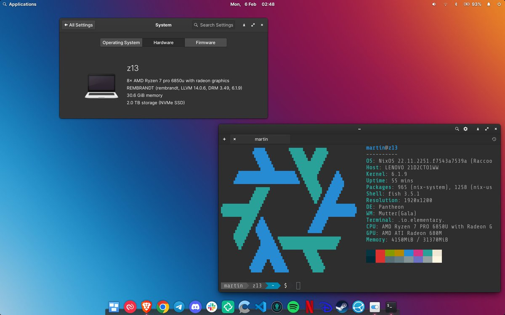

# Nix


---


---

- How often do you find yourself in a situation where something builds and works
on your machine but fails catastrophically in CI or production?

- In many cases, such problems are a symptom of a deeper issue that developers deal with:
lack of reproducibility.

- Your code depends on an environment variable at
compile time, or significantly changes behavior with different versions of a
dependency: such problems are usually hard to diagnose and even harder to fix.


* **So here's Nix...**

---

Nix is:
* a package manager
* [a language](https://serokell.io/nix-development)
* a build system
* a chaching system
* a distributed compilation platform
* an operating system??

---
`🤯🤯NixOS🤯🤯`





---

# Where did Nix come from?

- Eelco Dolstra is the original author of Nix
- 2003-04-11 first stable release of the package manager
- 2003-06-03 first stable release of NixOS

---

# Nix - Purely Functional

Nix provides a purely functional approach to package
 management. Each package and its dependencies are treated as immutable,
 allowing for deterministic builds and reproducibility.

- 🐳 In contrast, Docker relies on an imperative approach to build layers and
images: this can lead to variability in the build process.

- _Imperative programming_ - a programming paradigm of software that uses
statements that change a program's state. In much the same way that the
imperative mood in natural languages expresses commands, an imperative program
consists of commands for the computer to perform.

---
# Nix - Declarative Specification

With Nix, package specifications are
declarative and describe the exact versions and dependencies required for a
build. This eliminates version conflicts and ensures consistent builds across
different environments.

- 🐳 Although you can specify package versions in
a `Dockerfile`, there is less guarantee of reproducibility due to potential
conflicts arising from base images and external dependencies interacting with
each other.

---

# Nix - Hermetic Builds

Nix provides a hermetic build environment, meaning that builds are isolated
from the host system and other builds. This isolation ensures that the build
process is not influenced by the host's configuration or external factors and
is given the _least_ amount of privileges needed.

- 🐳 Although Docker offers isolation between steps, interations with the
host system are common and can happen at all phases in the build process
- This means host-level dependencies and configurations can produce false
negatives/positives

---

# Nix - Rollbacks and Atomic Updates

Nix allows for easy rollbacks and atomic updates of packages and configurations
through a concept called _generations_.
If a build fails or produces
undesirable results, it is straightforward to revert to a known working state.

```
 nix-env --list-generations
  95   2004-02-06 11:48:24
  96   2004-02-06 11:49:01
  97   2004-02-06 16:22:45
  98   2004-02-06 16:24:33   (current)
```

- 🐳 Docker lacks built-in mechanisms for rollbacks and atomic updates, requiring
 additional tooling and management practices to achieve similar functionality.

---

# Nix - Rollbacks and Atomic Updates cont.

- Profiles and user environments are Nix’s mechanism for implementing the ability
to allow different users to have different configurations, and to do atomic
upgrades and rollbacks.
- If two packages differ in _any_ way, they end up in
different locations in the file system, so they don’t interfere with each
other.

---

# Nix - Rollbacks and Atomic Updates cont.


For instance:
- a particular version of the
Subversion (`svn`) package might be stored in a directory
`/nix/store/dpmvp969yhdqs7lm2r1a3gng7pyq6vy4-subversion-1.1.3/`
- another version might be stored in
  `/nix/store/5mq2jcn36ldlmh93yj1n8s9c95pj7c5s-subversion-1.1.2`.
- The long strings prefixed to the directory names are cryptographic hashes;
  to be precise: 160-bit truncations of _SHA-256_ hashes encoded in a base-32 notation)
  of **all inputs involved in building the package** — sources, dependencies,
  compiler flags, etc.

---

# Nix - Rollbacks and Atomic Updates cont.

Here is what a part of a typical Nix store looks like:


- [Nix profiles](https://nixos.org/manual/nix/stable/package-management/profiles.html)

---

# Nix - Content-Adressable Store

Nix employs a content-addressable store, where
packages are identified by cryptographic hashes of their contents. This enables
caching and sharing of build artifacts, making it easier to reproduce builds
across different machines or even at different points in time.

- 🐳 Docker relies on layer-based image construction, which can make it more
challenging to achieve the same level of caching and sharing.

```
/nix/store/zzcv73zczrpc6rzmzy67ynbapvgqgd24-perl5.36.0-Digest-HMAC-1.03.drv
           ^^^^^^^^^^^^^^^^^^^^^^^^^^^^^^^^-^^^^^^^^^^-^^^^^^^^^^^^^^^^
           │                              │ │        │ │              │
           └           hash               ┴ ┴  name  ┴ ┴     tag      ┘.drv
```

---

# Nix - Content-Adressable Store cont.

Derivations can be very diverse:

```
/nix/store/zzfz7x9yfinm0mlhcdrj0cfxapfjlys8-cargo-package-inferno-0.11.15.drv
/nix/store/zzg5sicaqi4812wj3nhlrvrrk5hagr19-opentelemetry-0.17.0.drv
/nix/store/zzk9zhfpzph8rfy5v1k44zvx946085ml-cargo-package-rustls-native-certs-0.6.3.drv
/nix/store/zzv3xzbpmb12pc350y9p57wnccdrdfbc-cargo-package-crc32fast-1.3.2.drv
/nix/store/zzzh3k4p0lb56g3n3qp3yfvhnfq6cck2-python3.10-pytest-timeout-2.1.0.drv
```

---

# Nix - Reproducible Environments

Nix enables the creation of reproducible
environments with precise control over the exact versions of packages and
dependencies used. This is particularly useful for ensuring that software
builds are consistent across development, testing, and production environments.

- 🐳 Docker can also provide reproducible environments but may require additional
effort and care to achieve the same level of determinism.
- Nix: isolation is the default


---

# Nix - Derivation

- A Nix derivation is a description of how to build a package. It specifies
the source code, dependencies, build instructions, and other relevant details
needed to produce the desired package.
- Derivations are defined using the Nix expression language and are typically
stored in `.nix` files.

---

# Derivation - Basics

- A derivation consists of a set of attributes that define the package.
- The attributes include metadata like the package name, version, dependencies, and build instructions.
- The build instructions typically include a sequence of commands or a build script.

```nix
{ stdenv, fetchFromGitHub }:

stdenv.mkDerivation {
  name = "my-package";
  version = "1.0";
  src = ./.;
  buildPhase = "make";
  installPhase = "make install";
}
```

---

# Derivation - Source Attribute (`src`)

- Talk about
- The `src` attribute specifies the source code or resources required for
building the package.
- It can be a URL, local path, or a function that fetches
the source from a specific location (e.g., a Git repository).

```nix
{ stdenv, fetchFromGitHub }:

stdenv.mkDerivation {
  name = "my-package";
  version = "1.0";
    src = fetchFromGitHub {
      owner = "myusername";
      repo = "my-package";
      rev = "abcdef123456";
    };
};
```
---

# Derivation - Dependencies/`buildInputs`

`buildInputs` - include a derivation's dependencies on other packages
- Dependencies are specified as a list of Nix expressions representing other derivations.

```nix
{ stdenv, fetchFromGitHub }:

stdenv.mkDerivation {
  name = "my-package";
  version = "1.0";
  src = ./.;
  buildInputs = [ pkgs.gnumake ];
  buildPhase = ''
    make
  '';
  installPhase = "make install";
}
```

---

# Derivation - `buildPhase` and `installPhase`

`buildPhase` - defines the commands or build script that will be executed to build the package.
`installPhase` - specifies the commands or script to run for installing the built package into the Nix store.

---

# Derivation - artifact
- The Nix derivation, when evaluated, produces a package by following the
specified build instructions and incorporating the declared dependencies. The
resulting package is stored in the Nix store, which is a content-addressable
filesystem managed by Nix.

- [Nix package website](https://nixos.org/)

---


```nix
{ callPackage
, lib
, stdenv
, fetchurl
, nixos
, testers
, hello
}:

stdenv.mkDerivation (finalAttrs: {
  pname = "hello";
  version = "2.12.1";

  src = fetchurl {
    url = "mirror://gnu/hello/hello-${finalAttrs.version}.tar.gz";
    sha256 = "sha256-jZkUKv2SV28wsM18tCqNxoCZmLxdYH2Idh9RLibH2yA=";
  };

  doCheck = true;

  passthru.tests = {
    version = testers.testVersion { package = hello; };

    invariant-under-noXlibs =
      testers.testEqualDerivation
        "hello must not be rebuilt when environment.noXlibs is set."
        hello
        (nixos { environment.noXlibs = true; }).pkgs.hello;
  };

  passthru.tests.run = callPackage ./test.nix { hello = finalAttrs.finalPackage; };

  meta = with lib; {
    description = "A program that produces a familiar, friendly greeting";
    longDescription = ''
      GNU Hello is a program that prints "Hello, world!" when you run it.
      It is fully customizable.
    '';
    homepage = "https://www.gnu.org/software/hello/manual/";
    changelog = "https://git.savannah.gnu.org/cgit/hello.git/plain/NEWS?h=v${finalAttrs.version}";
    license = licenses.gpl3Plus;
    maintainers = [ maintainers.eelco ];
    platforms = platforms.all;
  };
})
```

- [`hello` world](
https://search.nixos.org/packages?channel=23.05&show=hello&from=0&size=50&sort=relevance&type=packages&query=hello):
`$ nix-shell -p hello --verbose`


---

# Derivation - Output artifact

Here’s a really simple derivation for GNU `hello` in JSON format
with some (empty) fields omitted for brevity:

```json
{
  "/nix/store/sg3sw1zdddfkl3hk639asml56xsxw8pf-hello-2.10.drv": {
    "outputs": { "out": { "path": "/nix/store/dvv4irwgdm8lpbhdkqghvmjmjknrikh4-hello-2.10" } },
    "inputSrcs": [ "/nix/store/9krlzvny65gdc8s7kpb6lkx8cd02c25b-default-builder.sh" ],
    "inputDrvs": {
      "/nix/store/8pq31sp946581sbh2m18pb8iwp0bwxj6-stdenv-linux.drv": [ "out" ],
      "/nix/store/cni8m2cjshnc8fbanwrxagan6f8lxjf6-hello-2.10.tar.gz.drv": [ "out" ],
      "/nix/store/md39vwk6mmi64f6z6z9cnnjksvv6xkf3-bash-4.4-p23.drv": [ "out" ]
    },
    "platform": "x86_64-linux",
    "builder": "/nix/store/kgp3vq8l9yb8mzghbw83kyr3f26yqvsz-bash-4.4-p23/bin/bash",
    "args": [ "-e", "/nix/store/9krlzvny65gdc8s7kpb6lkx8cd02c25b-default-builder.sh" ],
    "env": {
      "buildInputs": "",
      "builder": "/nix/store/kgp3vq8l9yb8mzghbw83kyr3f26yqvsz-bash-4.4-p23/bin/bash",
      "doCheck": "1",
      "name": "hello-2.10",
      "nativeBuildInputs": "",
      "out": "/nix/store/dvv4irwgdm8lpbhdkqghvmjmjknrikh4-hello-2.10",
      "outputs": "out",
      "pname": "hello",
      "src": "/nix/store/3x7dwzq014bblazs7kq20p9hyzz0qh8g-hello-2.10.tar.gz",
      "stdenv": "/nix/store/hn7xq448b49d40zq0xs6lq538qvldls1-stdenv-linux",
      "system": "x86_64-linux",
      "version": "2.10"
    }
  }
}

```

```
$ nix-shell -p hello --verbose
```

---


